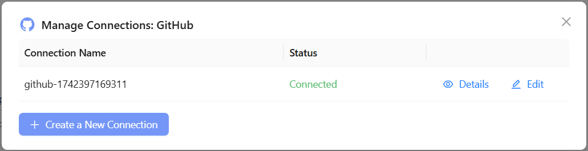
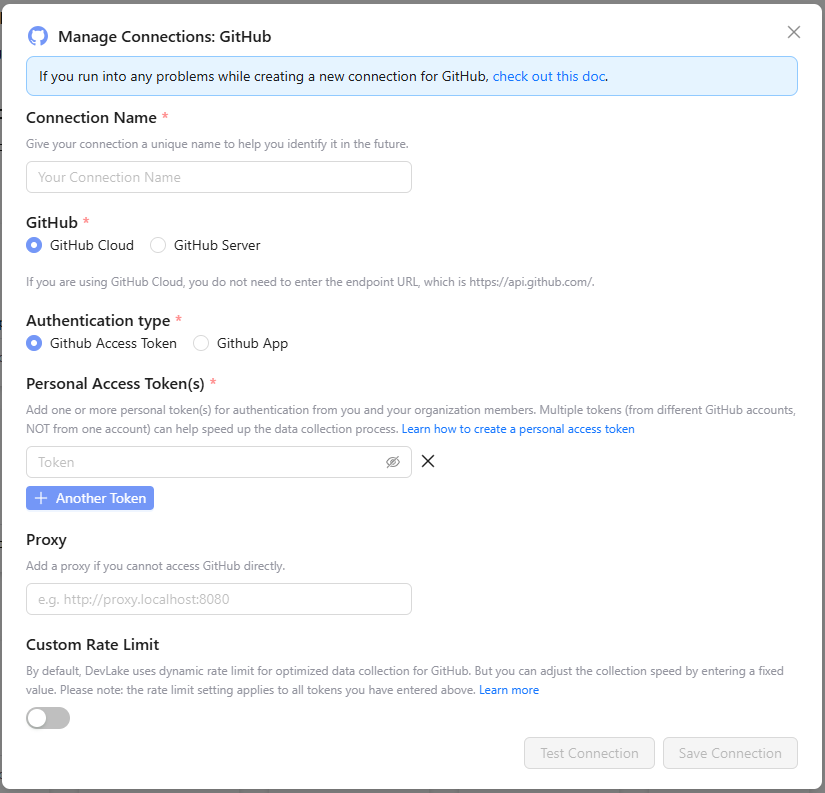
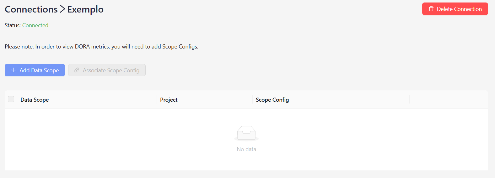
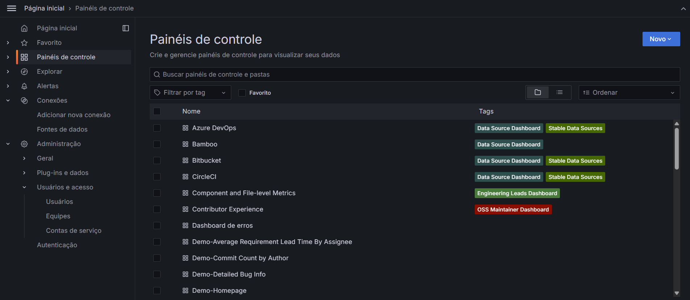
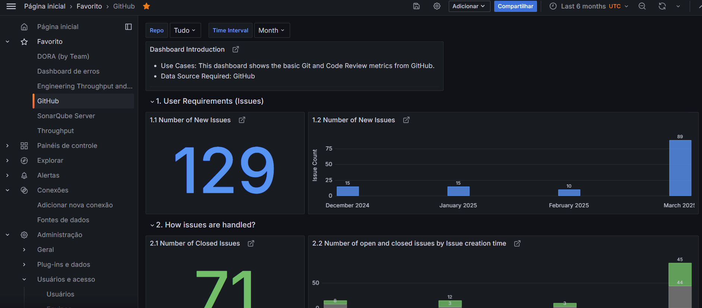
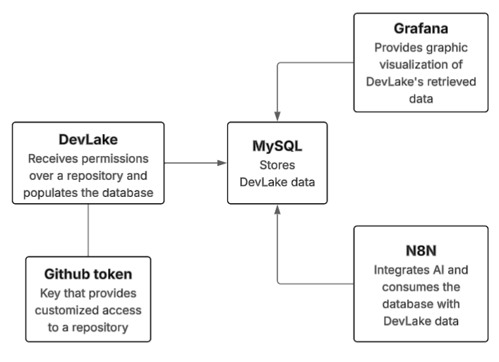
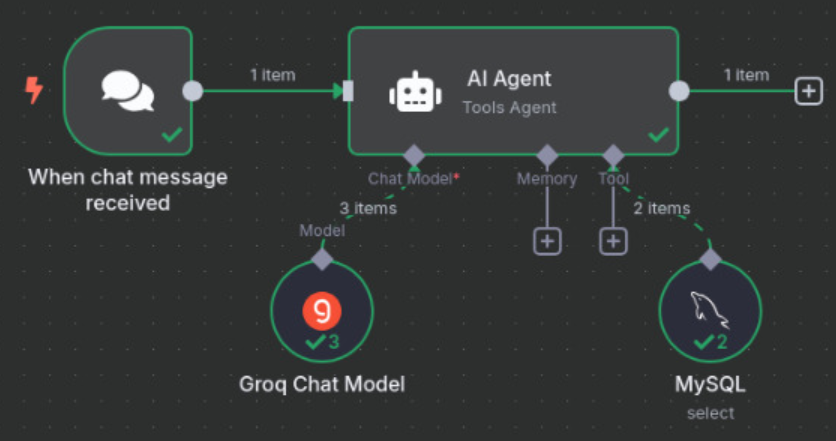
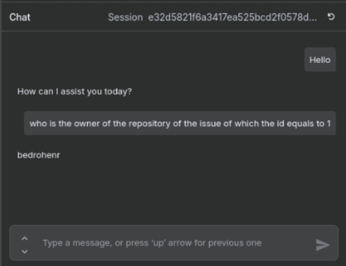

# DevLake - Installation and Configuration Guide

## Introduction

**DevLake** is a data engineering platform designed to collect, store, and analyze software development data from various tools.

This guide provides detailed instructions to set up and use DevLake in your local environment.

## Requirements

- Docker and Docker Compose installed  
- A **GitHub Access Token** (for GitHub integration)

## Installation

1. Clone the DevLake repository:

   ```sh
   git clone https://github.com/bedrohenr/oraculo.git
   cd oraculo
   ```

2. Configure the variables in `docker-compose.yml` and `.env` as needed.

3. Generate the `ENCRYPTION_SECRET` using the following command:

   ```sh
   openssl rand -base64 2000 | tr -dc 'A-Z' | fold -w 128 | head -n 1
   ```

4. Start DevLake by running:

   ```sh
   docker-compose up -d
   ```

   This will start all the containers (DevLake, ConfigUI, Nginx, MySQL, Grafana) needed to run the DevLake environment and N8n which will be used to integrate the AI to search on the MySQL database.

5. Access the DevLake dashboard at [`http://localhost:4000`](http://localhost:4000).  
   - Use the **username** and **password** configured in `docker-compose.yml` to log in.

6. Credentials
   - Devlake:
      - **Username**: devlake
      - **Password**: 123
   - MySQL
      - **Database**: lake
      - **Username**: merico
      - **Password**: 123 

## Configuration and Integration

### Creating a GitHub Connection

1. In the side menu, click on **Connections**.  
2. Select **GitHub** and click on **Create a New Connection**.

   

3. Fill in the required information and enter the **GitHub Access Token** for authentication.

   

4. Test the connection by clicking **Test Connection**.  
5. Click **Save Connection**. After saving, you'll be redirected to the connection screen:

   

6. Click on **+ Add Data Scope**, select the desired repositories, and click **Save**.

### Creating a Project

1. In the side menu, click **Projects** and then **+ New Project**.  
2. Enter a project name and click **Save**.  
3. When editing the project, in the **Data Connection** section, click **+ Add a Connection**.  
4. Select the previously created connection, choose the desired repositories, and click **Save**.  
5. Adjust the data sync frequency under the **Sync Policy** menu within the project.

Your DevLake environment is now configured and ready to use!

## Data Visualization with Grafana

DevLake uses **Grafana** to display the collected data.

1. Access Grafana at [`http://localhost:4000/grafana`](http://localhost:4000/grafana).  
2. Use the default credentials **admin:admin** to log in (it's recommended to change the password after the first login).  
3. Access Grafana’s main dashboard:

   

4. In the side menu, click on **Dashboards** to view the available dashboards.

   Example of a GitHub dashboard:

   

## N8N

[N8N](https://github.com/n8n-io/n8n) is an open-source workflow automation platform that gives technical teams the flexibility of code with the speed of no-code.

In this repository we will use it to integrate different systems about keeping tabs on the team's workflow.

We plan to integrate things such as Github repositories, JIRA, ..., with an AI, so the user will be capable to ask questions, about the workflow, through a chatbot and receive answers. 

### How it works

For now, still in testing purposes, we're using DevLake as the source to populate the database (MySQL) so we can run testes, the execution flow goes like this:

   Supersimplification of the execution:

   

Being like this, using N8N we can setup a connection to the MySQL container and make the AI search through its data.

   Example of a n8n rag:

   

This enables us to make questions like this:


   

Its still simple, but we're making progress.
